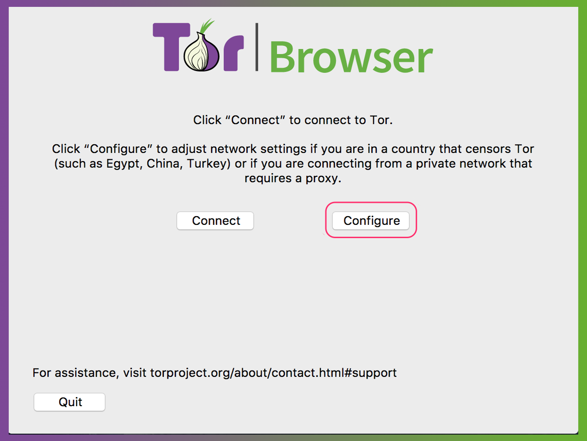
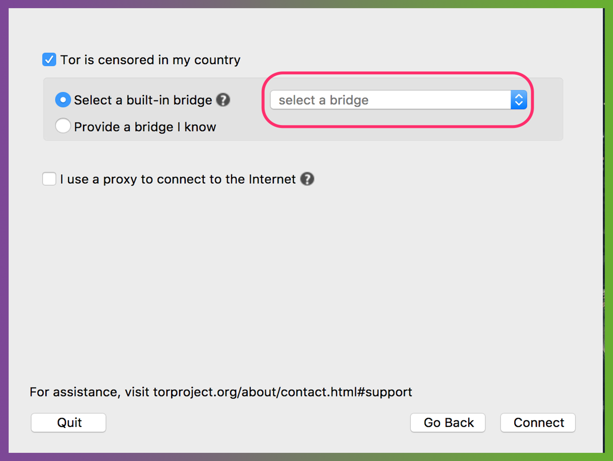

[Tor Browser User Manual](index.html "Tor Browser User Manual") »

# Circumvention

Direct access to the Tor network may sometimes be blocked by your Internet
Service Provider or by a government. Tor Browser includes some circumvention
tools for getting around these blocks. These tools are called “pluggable
transports”. See the [Pluggable Transports](transports.html "Pluggable
Transports") page for more information on the types of transport that are
currently available.

## Using pluggable transports

  1. 

To use pluggable transports, click "Configure" in the Tor Launcher window that
appears when you first run Tor Browser.

You can also configure pluggable transports while Tor Browser is running, by
clicking on the green onion near your address bar and selecting “Tor Network
Settings”.

  2. Select “yes” when asked if your Internet Service Provider blocks connections to the Tor network. 

  3. 

Select “Connect with provided bridges”. Tor Browser currently has six
pluggable transport options to choose from.

## Which transport should I use?

Each of the transports listed in Tor Launcher’s menu works in a different way
(for more details, see the [Pluggable Transports](transports.html "Pluggable
Transports") page), and their effectiveness depends on your individual
circumstances.

If you are trying to circumvent a blocked connection for the first time, you
should try the different transports: obfs3, obfs4, ScrambleSuit, fte, meek-
azure and Snowflake.

If you try all of these options, and none of them gets you online, you will
need to enter bridge addresses manually. Read the [Bridges](bridges.html
"Bridges") section to learn what bridges are and how to obtain them.

## More Information

  * [Bridges](bridges.html "Bridges") — Learn what bridges are and how to get them
  * [Pluggable Transports](transports.html "Pluggable Transports") — Types of pluggable transport
  * [Tor Browser User Manual](index.html "Tor Browser User Manual")

