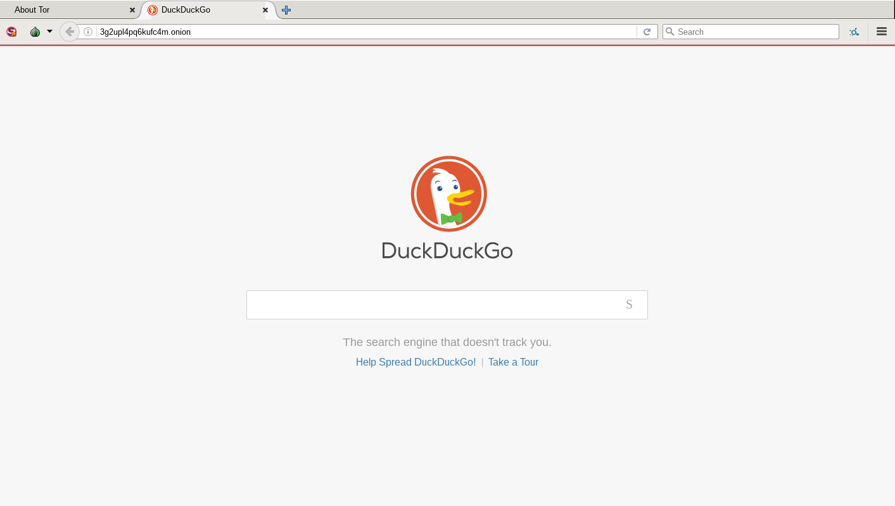

[Tor Browser User Manual](index.html "Tor Browser User Manual") »

# Onion Services

Onion services (formerly known as “hidden services”) are services (like
websites) that are only accessible through the Tor network.

Onion services offer several advantages over ordinary services on the non-
private web:

  * An onion services’s location and IP address are hidden, making it difficult for adversaries to censor it or identify its operators. 

  * All traffic between Tor users and onion services is end-to-end encrypted, so you do not need to worry about [connecting over HTTPS](secure-connections.html "Secure Connections"). 

  * The address of an onion service is automatically generated, so the operators do not need to purchase a domain name; the .onion URL also helps Tor ensure that it is connecting to the right location and that the connection is not being tampered with. 

## How to access an onion service

Just like any other website, you will need to know the address of an onion
service in order to connect to it. An onion address is a string of 16 (and in
V3 format, 56) mostly random letters and numbers, followed by “.onion”.

## Troubleshooting

If you cannot reach the onion service you require, make sure that you have
entered the onion address correctly: even a small mistake will stop Tor
Browser from being able to reach the site.

If you are still unable to connect to the onion service, please try again
later. There may be a temporary connection issue, or the site operators may
have allowed it to go offline without warning.

You can also ensure that you're able to access other onion services by
connecting to [DuckDuckGo's Onion Service](http://3g2upl4pq6kufc4m.onion/
"http://3g2upl4pq6kufc4m.onion/")

## More Information

  * [Tor Browser User Manual](index.html "Tor Browser User Manual")

