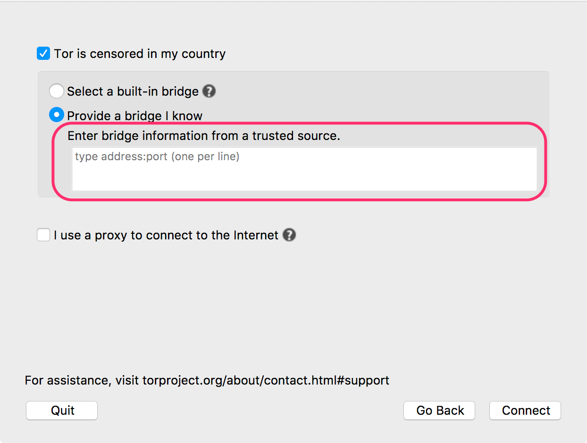

# Bridges

Most [Pluggable Transports](transports.html "Pluggable Transports"), such as
obfs3 and obfs4, rely on the use of “bridge” relays. Like ordinary Tor relays,
bridges are run by volunteers; unlike ordinary relays, however, they are not
listed publicly, so an adversary cannot identify them easily. Using bridges in
combination with pluggable transports helps to disguise the fact that you are
using Tor.

Other pluggable transports, like meek, use different anti-censorship
techniques that do not rely on bridges. You do not need to obtain bridge
addresses in order to use these transports.

## Getting bridge addresses

Because bridge addresses are not public, you will need to request them
yourself. You have two options:

  * Visit <https://bridges.torproject.org/> and follow the instructions, or 

  * Email bridges@torproject.org from a Gmail, Yahoo, or Riseup email address, or 

## Entering bridge addresses

Once you have obtained some bridge addresses, you will need to enter them into
Tor Launcher.

Choose “yes” when asked if your Internet Service Provider blocks connections
to the Tor network. Select “Use custom bridges” and enter each bridge address
on a separate line.

Click “Connect”. Using bridges may slow down the connection compared to using
ordinary Tor relays. If the connection fails, the bridges you received may be
down. Please use one of the above methods to obtain more bridge addresses, and
try again.

