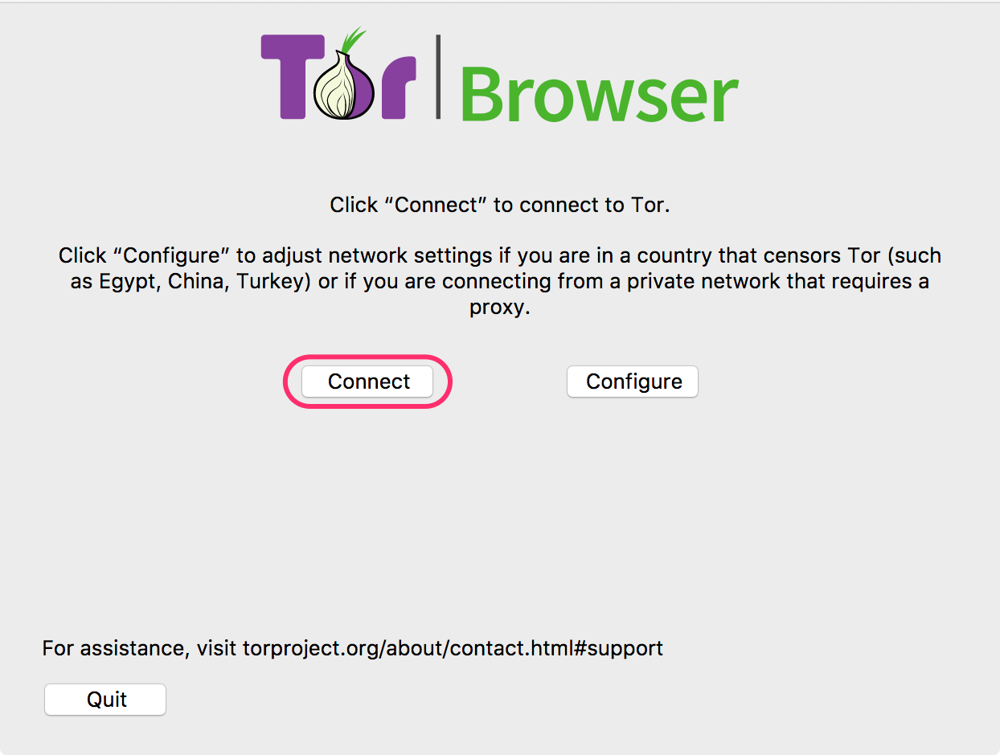
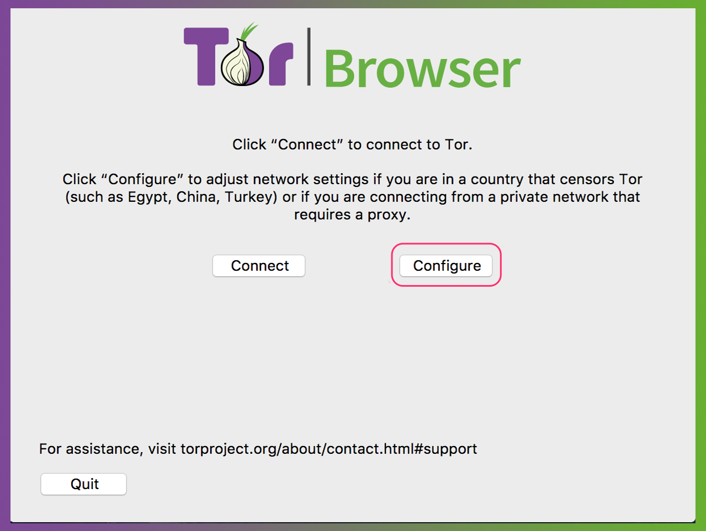
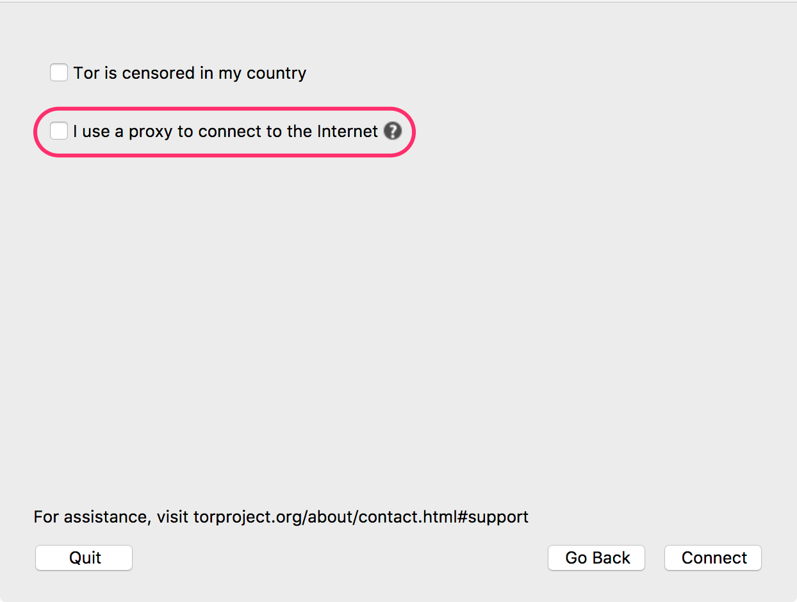
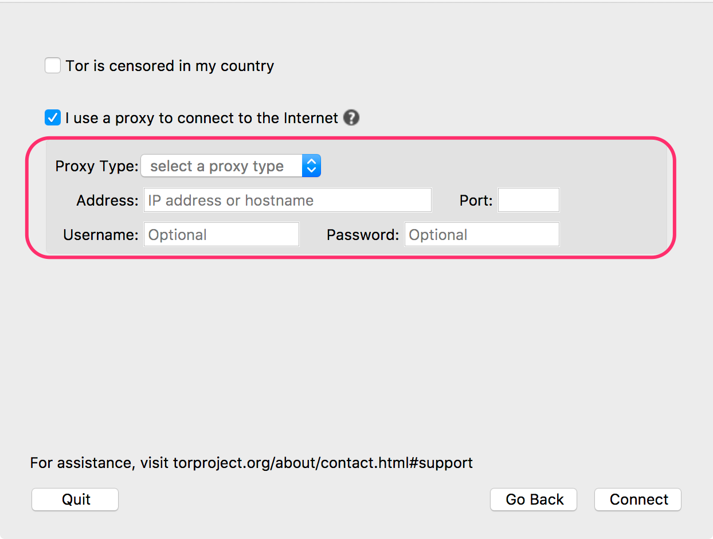

[Tor Browser User Manual](index.html "Tor Browser User Manual") »

# Running Tor Browser for the first time

When you run Tor Browser for the first time, you will see the Tor Network
Settings window. This offers you the option to connect directly to the Tor
network, or to configure Tor Browser for your connection.

## Connect

In most cases, choosing "Connect" will allow you to connect to the Tor network
without any further configuration. Once clicked, a status bar will appear,
showing Tor’s connection progress. If you are on a relatively fast connection,
but this bar seems to get stuck at a certain point, see the
[Troubleshooting](troubleshooting.html "Troubleshooting") page for help
solving the problem.

## Configure

If you know that your connection is censored, or uses a proxy, you should
select this option. Tor Browser will take you through a series of
configuration options.

  1. The first screen asks if access to the Tor network is blocked or censored on your connection. If you do not believe this is the case, select “No”. If you know your connection is censored, or you have tried and failed to connect to the Tor network and no other solutions have worked, select “Yes”. You will then be taken to the [Circumvention](circumvention.html "Circumvention") screen to configure a pluggable transport. 

  2. The next screen asks if your connection uses a proxy. In most cases, this is not necessary. You will usually know if you need to answer “Yes”, as the same settings will be used for other browsers on your system. If possible, ask your network administrator for guidance. If your connection does not use a proxy, click “Continue”. 

## More Information

  * [Tor Browser User Manual](index.html "Tor Browser User Manual")

