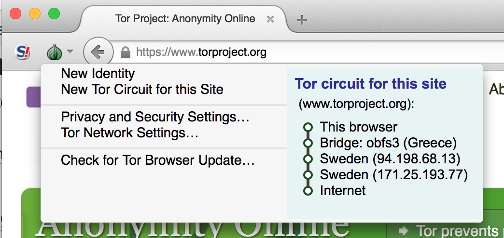
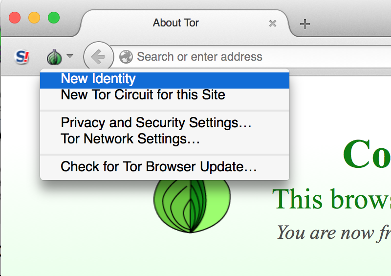

[Tor Browser User Manual](index.html "Tor Browser User Manual") »

# Managing identities

When you connect to a website, it is not only the operators of that website
who can record information about your visit. Most websites now use numerous
third-party services, including social networking “Like” buttons, analytics
trackers, and advertising beacons, all of which can link your activity across
different sites.

Using the Tor network stops observers from being able to discover your exact
location and IP address, but even without this information they might be able
to link different areas of your activity together. For this reason, Tor
Browser includes some additional features that help you control what
information can be tied to your identity.

## The URL bar

Tor Browser centers your web experience around your relationship with the
website in the URL bar. Even if you connect to two different sites that use
the same third-party tracking service, Tor Browser will force the content to
be served over two different Tor circuits, so the tracker will not know that
both connections originate from your browser.

On the other hand, all connections to a single website address will be made
over the same Tor circuit, meaning you can browse different pages of a single
website in separate tabs or windows, without any loss of functionality.

You can see a diagram of the circuit that Tor Browser is using for the current
tab in the onion menu.

## Logging in over Tor

Although Tor Browser is designed to enable total user anonymity on the web,
there may be situations in which it makes sense to use Tor with websites that
require usernames, passwords, or other identifying information.

If you log into a website using a regular browser, you also reveal your IP
address and geographical location in the process. The same is often true when
you send an email. Logging into your social networking or email accounts using
Tor Browser allows you to choose exactly which information you reveal to the
websites you browse. Logging in using Tor Browser is also useful if the
website you are trying to reach is censored on your network.

When you log in to a website over Tor, there are several points you should
bear in mind:

  * See the [Secure Connections](secure-connections.html "Secure Connections") page for important information on how to secure your connection when logging in. 

  * Tor Browser often makes your connection appear as though it is coming from an entirely different part of the world. Some websites, such as banks or email providers, might interpret this as a sign that your account has been hacked or compromised, and lock you out. The only way to resolve this is by following the site’s recommended procedure for account recovery, or contacting the operators and explaining the situation. 

## Changing identities and circuits

Tor Browser features “New Identity” and “New Tor Circuit for this Site”
options, located in the Torbutton menu.

New Identity

    

This option is useful if you want to prevent your subsequent browser activity
from being linkable to what you were doing before. Selecting it will close all
your open tabs and windows, clear all private information such as cookies and
browsing history, and use new Tor circuits for all connections. Tor Browser
will warn you that all activity and downloads will be stopped, so take this
into account before clicking “New Identity”.

New Tor Circuit for this Site

    

This option is useful if the [exit relay](about-tor-browser.html#how-tor-works
"How Tor works") you are using is unable to connect to the website you
require, or is not loading it properly. Selecting it will cause the currently-
active tab or window to be reloaded over a new Tor circuit. Other open tabs
and windows from the same website will use the new circuit as well once they
are reloaded. This option does not clear any private information or unlink
your activity, nor does it affect your current connections to other websites.

## More Information

  * [Tor Browser User Manual](index.html "Tor Browser User Manual")

