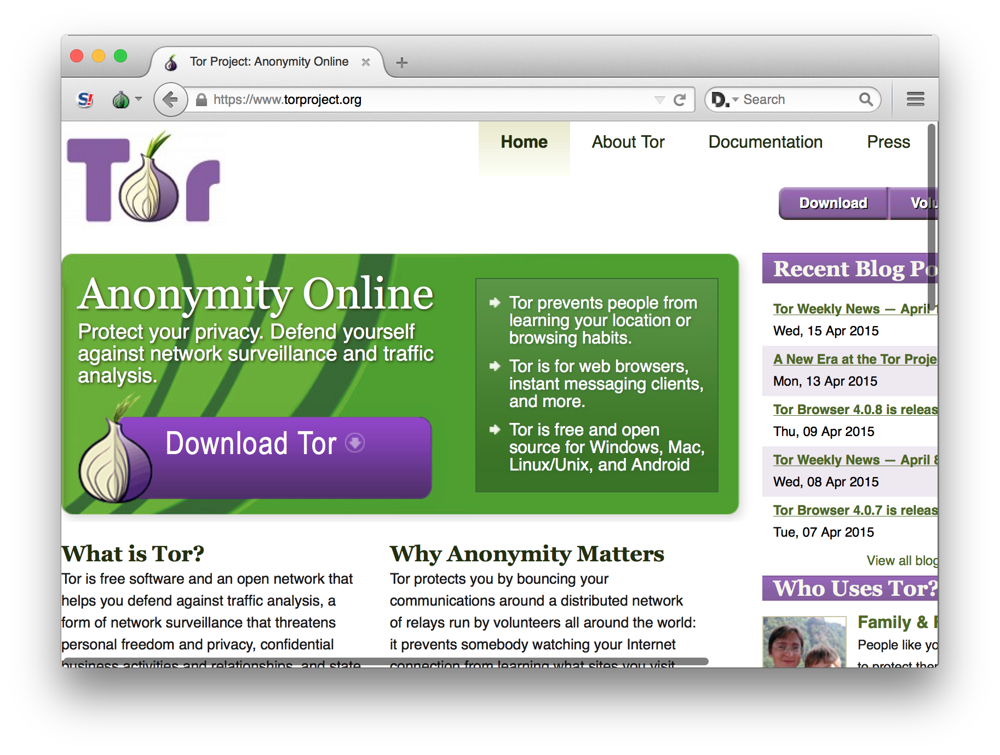

[Tor Browser User Manual](index.html "Tor Browser User Manual") »

# Secure Connections

If personal information such as a login password travels unencrypted over the
Internet, it can very easily be intercepted by an eavesdropper. If you are
logging into any website, you should make sure that the site offers HTTPS
encryption, which protects against this kind of eavesdropping. You can verify
this in the URL bar: if your connection is encrypted, the address will begin
with “https://”, rather than “http://”.

The following visualization shows what information is visible to eavesdroppers
with and without Tor Browser and HTTPS encryption:

Specify "ltr" for left-to-right languages or "rtl" for right-to-left languages
(e.g. Arabic or Hebrew). Keep it short: 7em max. Seven times the capital
letter "M". Keep it short: 8em is ok, 9em is max. Keep it short: 3em max. Keep
it short: 4em max. Tor and HTTPS image/svg+xmlTor and
HTTPShttps://gitweb.torproject.org/user/lunar/tor-and-https.gitEFFEFF Lunar
Site.comuser / pwdatalocationWiFiISPHackerLawyerSysadminPoliceNSATor
relayKeyInternet connectionEavesdroppingData sharingTorHTTPSstring-tor string-
hacker string-nsa string-lawyer string-nsa string-wifi string-isp string-
police string-lawyer string-police string-sysadmin string-sysadmin string-site
string-isp string-tor string-https string-eavesdropping string-internet-
connection string-key string-data-sharing string-tor-relay string-tor-relay
string-tor-relay

  * Click the “Tor” button to see what data is visible to observers when you're using Tor. The button will turn green to indicate that Tor is on. 

  * Click the “HTTPS” button to see what data is visible to observers when you're using HTTPS. The button will turn green to indicate that HTTPS is on. 

  * When both buttons are green, you see the data that is visible to observers when you are using both tools. 

  * When both buttons are grey, you see the data that is visible to observers when you don't use either tool. 

## Potentially visible data

Site.com

    

The site being visited.

user / pw

    

Username and password used for authentication.

data

    

Data being transmitted.

location

    

Network location of the computer used to visit the website (the public IP
address).

Tor

    

Whether or not Tor is being used.

## More Information

  * [Tor Browser User Manual](index.html "Tor Browser User Manual")

