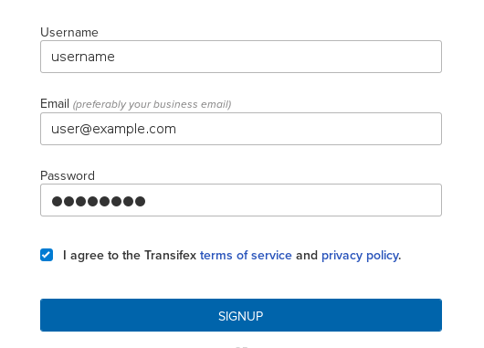
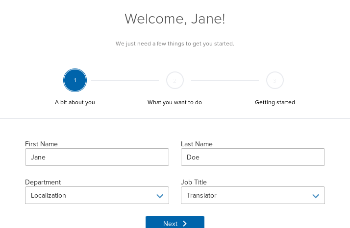
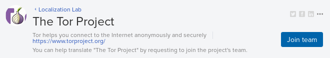
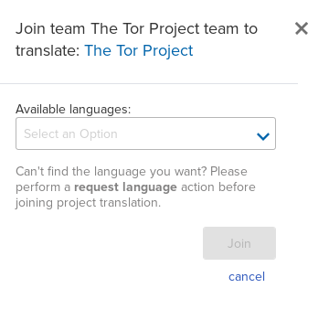
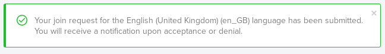

[Tor Browser User Manual](index.html "Tor Browser User Manual") »

# Becoming a Tor Translator

If you are interested in helping out the project by translating the manual or
the Tor Browser to your language, your help would be greatly appreciated! In
order to begin contributing you will have to sign up with Transifex, the
third-party that faciliates our translations. Below is an outline of how to
sign up and begin.

## Signing up on Transifex

  1. Head over to the [Transifex signup page](https://transifex.com/signup/ "https://transifex.com/signup/"). 

  2. Enter your information into the fields and click the 'Sign Up' button: 

  3. Fill out the next page with your name and select "Localization" and "Translator" from the drop-down menus: 

  4. On the next page, select 'Join an existing project' and continue. 

  5. On the next page, select the languages you speak from the drop-down menu and continue. 

  6. You are now signed up! Go to the [Tor Transifex page](https://www.transifex.com/otf/torproject/ "https://www.transifex.com/otf/torproject/"). 

  7. Click the blue 'Join Team' button on the far right: 

  8. Select the language you would like to translate from the dropdown menu: 

  9. A notification will now show up on the top of the page like so: 

After your membership is approved you can begin translating; simply navigate
back to the [Tor Transifex page](https://www.transifex.com/otf/torproject/
"https://www.transifex.com/otf/torproject/") when you are ready to begin.
Thanks for your interest in helping the project!

## More Information

  * [Tor Browser User Manual](index.html "Tor Browser User Manual")

