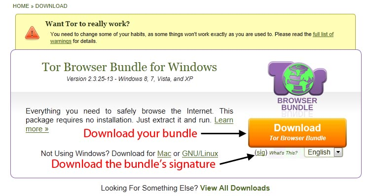
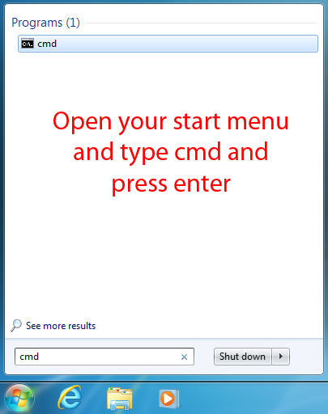
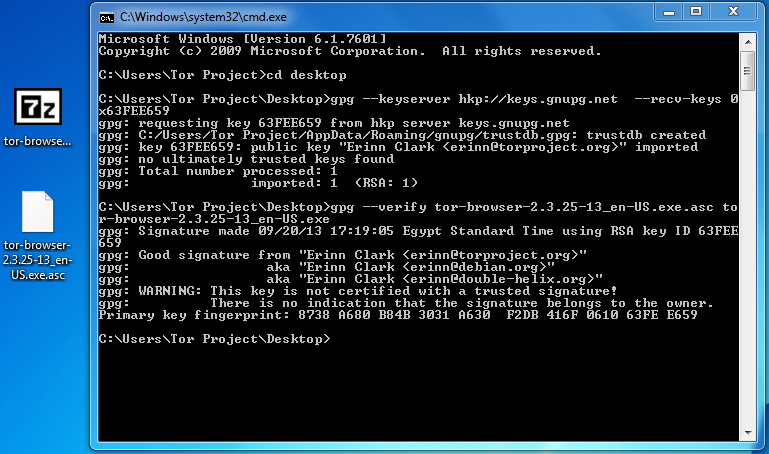

[ Tor 浏览器用户手册](index.html "Tor 浏览器用户手册") »

# Verify

This section is about verifying the signature for your downloaded file.

These instructions apply to Windows, Mac and Linux.

Why you should always verify files after downloading: How do you know that the
Tor program you have is really the one we made? Digital signatures ensure that
the package you are downloading was created by our developers. If the Tor
package has been modified by some attacker it is not safe to use. It doesn't
matter how secure and anonymous Tor is if you're not running the real Tor. For
details see the chapter Why to verify signatures in our verification guide. It
also explains, what digital signatures are and which software you need.

## Verify the downloaded Tor Browser archive

  1. Download the Tor Browser archive and its .asc signature file to your Desktop. It is important to downoad both to the same directory, so they can be found by your verification program. 

  2. Open a command prompt or Terminal: 

  3. Enter the following commands to verify the bundle: (Change the file name to the file you downloaded) 

  4. You should see Good signature from "Tor Browser Developers (signing key) if not, please retry these steps. 

For details check out the verifying signatures guide on the Torproject
website.

## 更多信息

  * [ Tor 浏览器用户手册](index.html "Tor 浏览器用户手册")

## 关于

© 2016 YF

© 2016 danfong

© 2016 naruto861214

© 2016 Vel

© 2016 Agustín Wu

© 2016 Chinrur Yang

© 2016 LNDDYL

© 2017 Mingye Wang (Arthur2e5)

翻译者

  * YF
  * danfong
  * naruto861214
  * Vel
  * Agustín Wu
  * Chinrur Yang
  * LNDDYL
  * Mingye Wang (Arthur2e5)

